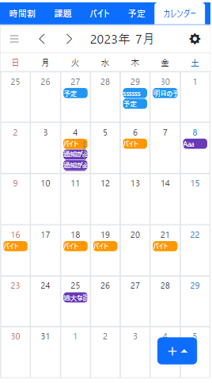

<!-- _class: title -->
# Murakami's Portfolio
### 河原電子ビジネス専門学校 村上聖音
#### sorera620@gmail.com

---
<!-- _class: introduction -->
# 自己紹介
- 所属: 河原電子ビジネス専門学校
- 興味分野: クラウド, IaC
 

- 学科: ITイノベーション科3年
- 産業能率大学 情報マネジメント学部 現代マネジメント学科 通信教育課程 3年
- キャリア目標: ソリューションアーキテクト
    - AWSやAzureの環境でクラウドインフラの設計と運用を担当することを目標
---
<!-- _class: table-of-contents -->
# 目次
1. [スキルセット](#1-スキルセット)
2. プロジェクト紹介
    1. [ジャンプゲーム](#2-1-ジャンプゲーム)
    2. [TRPG用キャラクターデータ管理システム](#2-2-trpg用キャラクターデータ管理システム)
    3. [TRPG用WebアプリのUI/UX改善拡張機能](#2-3-trpg用webアプリのuiux改善拡張機能)
    4. [自転車用後方検知システム](#2-4-自転車用後方検知システム)
    5. [学生向けカレンダーアプリ](#2-5-学生向けカレンダーアプリ)
    6. [Google From自動入力](#2-6-google-from自動入力)
    7. [体験型ARアートイベント](#2-7-体験型arアートイベント)
    8. [多人数参加型アート作成アプリ](#2-8-多人数参加型アート作成アプリ) <- 一番注力して開発しました
3. [リポジトリURL一覧](#3-リポジトリurl一覧)

---
<!-- _class: skill-set -->
# 1. スキルセット
- 得意言語: Typescript
    - 使用可能言語: Python3, PHP, ShellScript, (SQL)
- よく使うフレームワークやライブラリ: React, Material UI
- その他よく使うツール: GitHub, VSCode, AWS, Docker, (Discord, Slack)
- 資格:
    - AWS Certified Cloud Practitioner
    - Webクリエイター能力認定試験／HTML5 エキスパート
- [2022年度 えがおのえひめハッカソン 特別賞](https://x.com/WebIoTmakers/status/1604384262852972544)
    (Web×IoT メイカーズチャレンジ PLUS)
- [GitHub: CA01971172](https://github.com/CA01971172)

---
# 2-1. [ジャンプゲーム](https://ca01971148.github.io/jumpgame/title.html)

- プロジェクト名: 「Jump Game」
- 担当: プロジェクトマネージャー, 設計, 実装
- 制作時期: 1年次前期
- 使用技術: Typescript, HTML, CSS, Webpack
- プロジェクト概要
    - うさぎを操作し、ジャンプさせることでどんどん上を目指すゲーム
    - 動く床や滑る床など、様々なギミックに対処しながら上を目指す

---
# 2-1. ジャンプゲーム
- プロジェクトの背景:
    - 2022年度の学園祭で公開する制作物として開発
    - 子供でも楽しめるようなものにするために、ゲームを作った
- 工夫点:
    - 1年次にTypescriptとオブジェクト指向について学習したので、オブジェクト指向で設計・実装を行った
- プロジェクトの成果:
    - 2022, 2023年度に公開を行い、それぞれ50人程度に試遊してもらえた
    - 学園祭には子連れの家族がそこそこ来場するため、ターゲット層の見定めに成功した

---
# 2-1. ジャンプゲーム
- 学んだこと:
    - プロジェクトマネージャーとしての基礎
    - プログラミングの基礎
    - オブジェクト指向の基礎
    - HTML, CSSの基礎
- 感想:
    - かつてビジュアルプログラミングで作っていたようなゲームが、本物のプログラミング言語で作れて、動いて、感動した

---
# 2-2. [TRPG用キャラクターデータ管理システム](https://lyridev.github.io/DralphMyth-EnemyData/)

- プロジェクト名: 「ドラルフ神話戦闘データエディタ」
- 個人開発
- 制作時期: 1年次後期
- 使用技術: Javascript, HTML, CSS, firebase
- プロジェクト概要
    - TRPGで使用される、敵キャラクターデータの登録・編集を行うことができるWebアプリ

---
# 2-2. TRPG用キャラクターデータ管理システム
- プロジェクトの背景:
    - 友人とオリジナルのTRPGを遊ぶ中でゲームのプレイを有利にするために、登場した敵キャラクターの情報をメモ帳に書き留めていた
    - しかし、そのままではデータの統一性がなかったため、データクレンジングを行うために自分専用のアプリを制作した
- 工夫点:
    - JSON形式でデータを入出力できるようにした
    - TRPGオンラインセッションツール"ccfolia"へのキャラクターコマ出力機能を実装し、連携できるようにした
    - 名前検索やタグ名検索を実装した

---
# 2-2. TRPG用キャラクターデータ管理システム
- プロジェクトの成果:
    - 10人程度の小さいコミュニティでTRPGを遊んでいたため、結局使用者は自分しかいなかった
    - 名前検索やタグ検索により、ぱっと敵データを参照できるのが便利だった
- 課題や学んだこと:
    - サニタイジングによるセキュリティの強化の重要性を学んだ
        - Javascriptの`innerHTML`を用いて画面表示を実装したため、XSSへの対処ができていなかった
            - ユーザー間のデータ共有を実装できていなかったため、攻撃には繋がらなかったのでギリギリセーフ？
    - firebaseを用いたユーザー認証やデータベース操作の基礎を学べた

---
# 2-3. [TRPG用WebアプリのUI/UX改善拡張機能](https://chromewebstore.google.com/detail/%E6%8B%A1%E5%BC%B5%E3%83%81%E3%83%A3%E3%83%83%E3%83%88%E3%83%91%E3%83%AC%E3%83%83%E3%83%88/iehbjjbemjfopajfmanailijdaigflig?hl=ja&authuser=0)

- プロジェクト名: 「拡張チャットパレット」
- 個人開発
- 制作時期: 2年次前期
- 使用技術: Typescript, React, MUI, Webpack
- プロジェクト概要
    - TRPGオンラインセッションツール"ccfolia"のUI/UXを改善するための、Chrome拡張機能

---
# 2-3. TRPG用WebアプリのUI/UX改善拡張機能
- プロジェクトの背景
    - 元々ccfoliaには"チャットパレット"と呼ばれる、事前に保存したテキストを送信できる機能があった
    - しかし、一度に一行までしかテキストを保存できなかったり、チャットパレットからは発言キャラクターを変更できなかったりしたため、それらを改善するためにこの拡張機能をリリースした
- 工夫点:
    - "テキスト => 処理"の変換を行う処理を実装した
         => 

---
# 2-3. TRPG用WebアプリのUI/UX改善拡張機能
- プロジェクトの成果:
    - 権利関係上、知り合いにしか頒布しなかったため、ユーザー数は20人程度しか獲得できなかった
    - 自分がccfoliaを使っていて不便だと感じた部分は概ね解消できた
- 学んだこと:
    - 特定のフォーマットで記述されたテキストを処理やデータに変換する処理の大変さを学べた
    - ccfoliaがUIを変える度に拡張機能も更新しなければならないので、保守管理の大変さを学べた
    - 制作時はReactを授業でまだ習っていない段階で、独学で何かを学んで作る楽しさを学べた

---
# 2-4. [自転車用後方検知システム](https://x.com/WebIoTmakers/status/1604350122292174849)

- プロジェクト名: 「cyclIoT」
- 担当: 立案, 設計, 実装
- 制作時期: 1年次後期
- 使用技術: Javascript, Raspberry Pi
- プロジェクト概要
    - 自転車後方の物体を検知して危険を知らせることで、運転者をアシストするシステム
    - 後方の物体との距離に応じてランプが強く光る

---
# 2-4. 自転車用後方検知システム
- プロジェクトの背景
    - Web×IoT メイカーズチャレンジ PLUSというイベントで、ハッカソンを行った
    - 班員と話し合った結果、「愛媛県は自転車利用を促進しており、何か自転車関連のIoT製品を作れないか」ということになった
    - その結果、「自転車の右左折時に、後方から追い越そうとしてくる自転車との事故を防ぎたい」ということでこのシステムを開発することになった
- 工夫点:
    - 自転車後方に設置したセンサーは首振り式となっており、安いデバイスコストで幅広い範囲を検知できるようにした

---
# 2-4. 自転車用後方検知システム
- プロジェクトの成果:
    - 惜しくもえひめのえがおハッカソン(Web×IoT メイカーズチャレンジ PLUS)での優勝は逃したが、非常に実用的とのことで別枠が設けられ、特別賞を獲得することができた
- 学んだこと:
    - 普段使用しているJavascriptを用いて、Raspberry Piやセンサーを用いた組み込み系システムの構築について学ぶことができた
    - ハッカソンに初めて参加することで、アイデアの作り方やチームワークの重要性を学ぶことができた

---
# 2-5. [学生向けカレンダーアプリ](https://ca01971172.github.io/MySchedule/)

- プロジェクト名: 「MySchedule」
- 担当: プロジェクトマネージャー, 企画, 設計, 開発
- 制作時期: 2年次前期
- 使用技術: Typescript, React, Bootstrap, SCSS, Webpack, firebase, Docker, SendGrid API, PWA
- プロジェクト概要
    - バイトや課題の提出期限など、様々な予定を管理することのできる学生向けカレンダーアプリ

---
# 2-5. 学生向けカレンダーアプリ
- プロジェクトの背景:
    - 2023年度の学園祭で公開する制作物として開発
    - 専門学校について調べに来場する、学生をターゲットとして企画を行った
- 工夫点:
    - 上流工程にチャレンジするために、デザイン設計を行ったり、クラス設計書の作成を試みるなどした
    - プロジェクトマネージャーとして、ガントチャートの作成を行った
    - モバイルファーストを心掛け、スワイプなどの処理を実装した
- プロジェクトの成果:
    - 2023年度に公開を行ったが、20人程度しかユーザー数が伸びなかった

---
# 2-5. 学生向けカレンダーアプリ
- 課題や学んだこと:
    - オブジェクト指向で画面構築を行おうとしたが、結局難航してReactでの開発に切り替えることになってしまった
        - そもそもWebアプリはオブジェクト指向が向いてないのかもしれないと感じた
    - 設計に時間がかかりすぎてしまい、実装の時間が足りず、ほぼ自分一人で実装してしまった
        - 人材マネジメントの実力不足が露見した
    - カレンダーアプリが他のゲームクリエイター科の作品と見劣りしたのか、ユーザー登録が面倒だったのか、宣伝が下手だったのか、理由は定かではないがユーザー数の獲得ができなかった

---
# 2-6. [Google From自動入力](https://chromewebstore.google.com/detail/google-form-%E8%87%AA%E5%8B%95%E5%85%A5%E5%8A%9B/cnkplocmajogeekgijnpnfegeoggobbl?hl=ja&authuser=0)

- プロジェクト名: 「Google From自動入力」
- 個人開発
- 制作時期: 2年次後期
- 使用技術: Typescript, React, MUI, Vite
- プロジェクト概要
    - Google Formに自動でフォーム内容を入力してくれる、Chrome拡張機能

---
# 2-6. Google From自動入力
- プロジェクトの背景:
    - 授業の確認テストでGoogle Formを使用しており、毎回氏名とメールアドレスの入力を求められ、非常に手間だった
    - そのため、その手間を解消すべく、Chrome Web Storeで拡張機能をリリースした
- プロジェクトの成果:
    - Chrome Web Storeでユーザー数を200人以上獲得することができた
- 学んだこと:
    - マーケティングを行わずともユーザーを大量に獲得することができたので、需要を理解することの重要性を学べた

---
# 2-7. [体験型ARアートイベント](https://portal-wawwd.studio.site/)

- プロジェクト名: 「みんなの空間 ~We are what we do~」
- 担当: フロントエンド, インフラ構築
- 制作時期: 2年次後期
- 使用技術: Typescript, React, MUI, Three.js, Vite, Docker, Rust, Postgres, Redis, AWS
    - Three.jsを用いた3D処理と、Docker, Rust, Postgres, Redisを用いたバックエンド処理は他の学生が担当

---
# 2-7. 体験型ARアートイベント
- プロジェクト概要
    - 愛媛県内の約15箇所に備え付けられたQRコードを現地に行って読み取り、写真を1枚撮ると、3Dリングを1個生成することができるARアプリ
    - 多人数で協力し、リングを生成していくとチェーンのように繋がり、最終的に"DEI"という文字が完成する
    - 撮影した写真はNFT化され、後日購入可能

- `wawwd.net`というURLでプロジェクトを公開していたが、現在はイベント終了につき公開停止中
        - [レプリカページはこちら](https://we-are-what-we-do.github.io/we-are-what-we-do-replica/)

---
# 2-7. 体験型ARアートイベント
- プロジェクトの背景:
    - 「中央集権型から自律分散型へ」というWeb3の考えに則って企画されたイベント
    - 多様性、公平性、包摂性を意味する"DEI"の認知度向上を目的としている
    - 愛媛県の「Web3.0人材育成検証事業」の一環として行われた
        - 愛媛県のWeb3ウォレットからNFTを発行し、県の業務として暗号通貨資産を計上する試み
- 工夫点: プロジェクトが行き詰まらないよう、様々な技術的助力を行った
- プロジェクトの成果:
    - 愛媛県各地から多数のユーザーがアクセスし、最終的に946個ものリングが作成された

---
# 2-7. 体験型ARアートイベント
- 課題や学んだこと:
    - 学外の人々とチームを組んで開発を行ったため、チームワークの重要性を学ぶことができた
        - 主に、コミュニケーションの難しさ(認識のズレや報告漏れ等)に直面した
    - QRコードの設置に協力してくれている企業や団体からはイベント参加費用を頂いている他、一般ユーザーに公開して実際に体験してもらうということで、アプリリリースに際しての責任を学ぶことができた
    - AWSを使用したインフラ構築を行うことで、様々なAWSリソースの基礎を学ぶことができた
        - Route53, S3, CloudFront, EC2, ALB, ACM, Lambda, ...

---
# 2-8. [多人数参加型アート作成アプリ](https://hanabinovation.org/HF5W2T/create-firework/)

- プロジェクト名: 「HANABINOVATION」
- 担当: プロジェクトマネージャー, 企画, 設計, バックエンド, フロントエンド
- 制作時期: 3年次前期
- 使用技術: Typescript, React, AWS Cloud9
    - 企画, 設計, 花火のアニメーション, バックエンド, 企画運営を担当
- プロジェクト説明:
    - 2024年度河原学園大学園祭において、ITイノベーション科3年より公開したWebアプリ

---
# 2-8. 多人数参加型アート作成アプリ

- プロジェクト概要
    - 各専門学校が出展しているブースに設置されたQRコードを読み取り、スマートフォン上に花火を打ち上げるWebアプリ
    - 各ユーザーが作成した花火は「花火大会」機能で共有され、他のユーザーが作成した花火も見ることができる予定
    - 学園祭の来場者全員が作成した花火が集まり、1つの大きなアート作品になることを目指している

---

# 2-8. 多人数参加型アート作成アプリ
- プロジェクトの背景
    - ITイノベーション科が抱える、学園祭の出し物に関する問題解決が目的
        - 過去に作成したゲーム「[Jump Game](#2-1-ジャンプゲーム)」は、Unityなどのゲームエンジンを用いた開発を行っているゲームクリエイター科と比べて見劣りし、ブースに来てくれるユーザー数で明らかに下回っていた
            - オリジナリティ、つまり"ITイノベーション科"らしさが必要
                => ITイノベーション科の得意分野"Webアプリ"で勝負
        - カレンダーアプリ「[MySchedule](#2-5-学生向けカレンダーアプリ)」は、動きが地味で学園祭映えしなかった
            - 動きが派手で、わかりやすい面白さが必要
                => 花火をドカンと打ち上げる、アートアプリを提供

---

# 2-8. 多人数参加型アート作成アプリ
- アプリの説明
    - 一言で表すとスタンプラリーアプリ
        1. ユーザーは花火のデザインをセットアップから選択する
            - スタンプラリーでいうところの"スタンプ"をデザインする行為
        2. その後、デザインした花火の写真を撮る
            - スタンプラリーアプリでいうところの"スタンプを押す"行為
        3. 写真を撮り終えると、他の人がデザインした花火が打ち上がっている様子を見られる
    - アプリ使用イメージ:
        https://drive.google.com/file/d/1gU66D9UQvG3TQLsnPy_2oHfkDGBGQmfC/view?usp=sharing

---

# 2-8. 多人数参加型アート作成アプリ
- 工夫点
    - [企画書](https://github.com/KSF2024/Documents/blob/main/%E3%82%A2%E3%83%97%E3%83%AA%E4%BC%81%E7%94%BB%E6%9B%B8.md)から[要件定義書](https://github.com/KSF2024/Documents/blob/main/%E8%A6%81%E4%BB%B6%E5%AE%9A%E7%BE%A9%E6%9B%B8.md)の作成、実装、運用までを一貫して行った
    - スタンプラリー制覇のインセンティブとして、「抽選で当たる景品」「自分のデザインした花火のプロジェクターによる投影」という2つを用意した
        - プロジェクター投影イメージ:
            https://drive.google.com/file/d/14KW8CkL66k-4RLsR4RA5uoDzI8VtH3uI/view?usp=sharing
            - 過去に自分がデザインした花火を、一斉にプロジェクター画面内に打ち上げる機能

---

# 2-8. 多人数参加型アート作成アプリ
- 成果
    - 120人のユーザーにアプリを使ってもらえた
        - その内、24人のユーザーが10箇所のラリーポイントを制覇してくれた
    - 「体験型ARアートイベント」でお世話になった愛媛新聞社様から、スマコレランドまつやまというところでこのプロジェクトをやってみたいというお声がけをいただいた
- 課題
    - 学園祭参加者が9,000人程いるらしいので、その内の120人は少ないと感じた
        - 「スタンプラリーはやらない」という声が聞こえたので、そもそも需要がなかったのかもしれない(インセンティブが悪かった？)

---

# 2-8. 多人数参加型アート作成アプリ
- 課題
    - 企画書を出したのは学園祭当日の3か月前なのに、1週間前になって突然「ステージイベントとして抽選会は実施できない」と知らされた
        - 企画書を上げた段階ではその年の学園祭実行委員会が設立されておらず、責任の所在が不明瞭となっていた
        - 上長である先生を通して学園祭実行委員会と連絡を取っていたため、確認を怠るとすぐ進捗が分からなくなってしまっていた
- 学んだこと, 今後の展望
    - 「責任の所在を明確にする」「こまめな進捗確認」といった、綿密なコミュニケーションを取ることが、企画の根回しには非常に大切だと感じた
        - 次回からは、どうしても間に人間を挟む必要がある場合はこまめに進捗を確認したり、期限を決めたいと思った

---
# 3. リポジトリURL一覧
- 「[ジャンプゲーム](https://github.com/CA01971148/jumpgame)」
- TRPG用キャラクターデータ管理システム「[ドラルフ神話戦闘データエディタ](https://github.com/LyriDev/DralphMyth-EnemyData)」
- TRPG用WebアプリのUI/UX改善拡張機能「[拡張チャットパレット](https://github.com/LyriDev/ExtendedChatPalette)」
- 自転車用後方検知システム「[cyclIoT](https://github.com/CA01971172/cyclIoT)」
- 学生向けカレンダーアプリ「[MySchedule](https://github.com/CA01971172/MySchedule)」
    - サーバーサイドのリポジトリ「[MyScheduleServer](https://github.com/CA01971172/MyScheduleServer)」
- 「[Google From自動入力](https://github.com/CA01971172/GoogleFormAutoFiller)」
- 体験型ARアートイベント「[みんなの空間 ~We are what we do~](https://github.com/we-are-what-we-do/we-are-what-we-do)」
- 多人数参加型アート作成アプリ「[HANABINOVATION](https://github.com/KSF2024/HANABINOVATION)」
